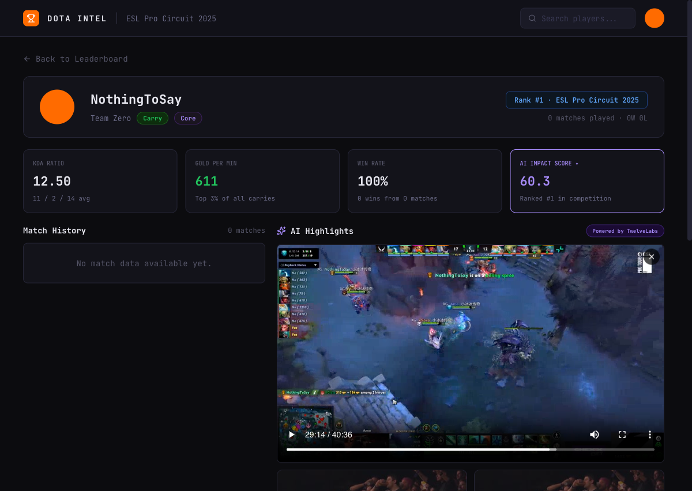

# 🎮 Dota Intel: AI-Powered Pro Performance Analytics

> **Winner's Vision**: Surface the most impactful moments in professional Dota 2 matches using TwelveLabs AI to identify highlights, calculate "AI Impact" scores, and present them in a premium, data-rich dashboard.



## 🚀 The Core Innovation
Dota Intel bridges the gap between raw match statistics and the visual excitement of pro play. By correlating **OpenDota match events** with **TwelveLabs Video AI (Marengo 3.0 & Pegasus 1.2)**, we've built an engine that doesn't just show *who* won, but *how* they dominated.

### Key AI Features:
*   **Pegasus-Powered Highlight Discovery**: Automatically identifies "RAMPAGE", "GODLIKE", and "TEAMFIGHT" moments by analyzing caster voice intensity and in-game banners.
*   **AI Impact Score**: A proprietary 0-100 metric that weights traditional KDA and GPM against AI-extracted "Excitement Scores" and highlight density.
*   **Intelligent Horn Calibration**: Automatically finds the game start (0:00) by locating the First Blood announcement or the horn sound in full-length Twitch VODs.
*   **Dynamic HLS Thumbnails**: Captures exact frame evidence from TwelveLabs HLS streams using offscreen canvas for a "Live" feel.

## 🛠 Tech Stack
*   **Video AI**: TwelveLabs SDK v0.4.0 (Marengo 3.0 for Search, Pegasus 1.2 for Analysis).
*   **Backend**: FastAPI (Python 3.14), Pydantic Models, OpenDota API.
*   **Frontend**: React 19 (Vite), TailwindCSS, HLS.js, Lucide Icons.
*   **Design**: "Premium Obsidian" theme implemented from `design.pen` Source of Truth.

## 🏃‍♂️ Getting Started

### 1. Prerequisites
*   Python 3.12+
*   Node.js 20+
*   TwelveLabs API Key (Marengo & Pegasus enabled)

### 2. Environment Setup
Create a `.env` file in the project root (and `dota-intel/`):
```env
TWELVELABS_API_KEY=your_key_here
OPENDOTA_BASE_URL=https://api.opendota.com/api
ESL_LEAGUE_NAME=ESL One Birmingham 2026
```

### 3. Start the Backend
```bash
cd dota-intel
pip install -r requirements.txt
./venv/bin/uvicorn backend.main:app --host 0.0.0.0 --port 8000
```

### 4. Start the Frontend
```bash
cd dota-intel/frontend
npm install
npm run dev
```

## 🎭 Presentation "Demo Mode"
Due to API rate limits on full-length match processing, we've included a high-fidelity **Demo Mode**.
*   **How to trigger**: Click the glowing **SPARKLE** icon in the header.
*   **What it does**: Switches the dashboard to a curated 7-match presentation dataset featuring legends like **Yatoro** and **Ame**, with highlights pre-mapped to existing TwelveLabs video indexes.

## 📊 Ingestion Pipeline
The ingestion engine (`dota-intel/scripts/seed_index.py`) is multi-staged and resilient:
1.  **Download**: Targeted segment extraction from Twitch VODs.
2.  **Upload**: Secure transfer to TwelveLabs.
3.  **Metadata**: Patching matches with OpenDota stats for AI search context.
4.  **Highlights**: Pegasus analysis of kills and teamfights.
5.  **Score**: Aggregation into global leaderboard rankings.

---
*Built for the TwelveLabs Hackathon 2026.*
